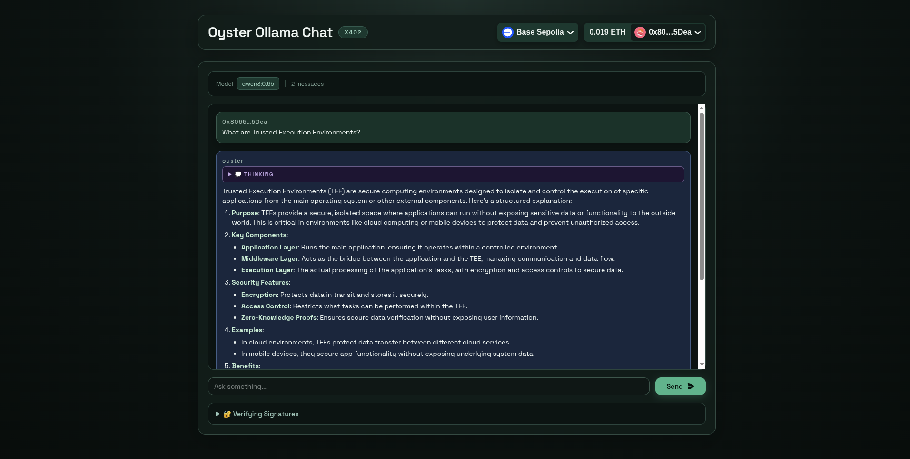

# Oyster Ollama Chat

A pay-per-prompt AI chat application that monetizes an [Ollama](https://ollama.ai) LLM behind the [x402](https://www.x402.org/) payment protocol. Users connect a wallet, pay micro-amounts in USDC per request, and chat with the model. Responses are generated and signed inside an [Oyster CVM](https://docs.marlin.org/oyster/) TEE for end-to-end verifiability.



## Architecture

```
┌────────────┐       ┌──────────────────┐       ┌──────────────┐
│  Frontend  │──────▶│  x402 Gateway    │──────▶│  Ollama      │
│  (Next.js) │ x402  │  (Rust / Axum)   │ HTTP  │  LLM Server  │
│  port 5000 │◀──────│  port 3000       │◀──────│  port 11434  │
└────────────┘       └──────────────────┘       └──────────────┘
```

1. The **Frontend** sends a chat request with an x402 payment header.
2. The **x402 Gateway** validates payment via the facilitator, forwards the request to **Ollama**, signs the response with a TEE-backed key, and returns it.
3. The **Frontend** renders the markdown response and displays signature verification info.

## Quick Start

### Backend (x402 Gateway)

The gateway is a high-performance Rust/Axum reverse proxy that intercepts HTTP requests, enforces x402 payment, and signs responses.

For full documentation, see [marlinprotocol/x402-gateway](https://github.com/marlinprotocol/x402-gateway).

#### Features

- **Multi-Chain Support** — Accept payments on Base, Polygon, Avalanche, Solana, and more.
- **Per-Endpoint Pricing** — Configure different USDC amounts for different routes.
- **TEE Signatures** — Responses signed with a secp256k1 key (via Oyster KMS).

#### Configuration

The gateway is configured via a `config.json` file.

| Field | Description |
|-------|-------------|
| `gateway_port` | Port the gateway listens on (default `3000`) |
| `facilitator_url` | x402 facilitator service URL |
| `target_api_url` | Backend API to proxy requests to (e.g. Ollama) |
| `networks[].type` | `"evm"` or `"solana"` |
| `networks[].network` | Network ID (e.g. `"base-sepolia"`, `"solana-devnet"`) |
| `networks[].payment_address` | Your wallet address for receiving payments |
| `routes.free` | Public routes that bypass payment |
| `routes.protected[].path` | Route path requiring payment |
| `routes.protected[].usdc_amount` | Cost in USDC micro-units (1000 = 0.001 USDC) |

### Frontend

A Next.js 16 + React 19 chat interface with wallet integration and x402 payment handling.

```bash
cd x402-frotend
npm install
npm run dev
```

The frontend will start on **http://localhost:5000**. Open it in your browser, connect your wallet, and start chatting.

#### Scripts

| Script | Description |
|--------|-------------|
| `npm run dev` | Start dev server on port 5000 |
| `npm run build` | Create optimised production build |
| `npm start` | Serve production build on port 5000 |

## Deploy on Oyster CVM

**Simulate locally:**

```bash
oyster-cvm simulate --docker-compose docker-compose.yml \
  --init-params "config.json:1:0:file:./config.json" -p 3000
```

**Deploy to production:**

```bash
oyster-cvm deploy \
  --wallet-private-key <key> \
  --duration-in-minutes 30 \
  --arch amd64 \
  --docker-compose docker-compose.yml \
  --init-params "config.json:1:0:file:./config.json"
```

## Verifying Signatures

**Get the expected public key from Oyster KMS:**

```bash
oyster-cvm kms-derive \
  --image-id <IMAGE_ID> \
  --path signing-server \
  --key-type secp256k1/public
```

If both public keys match, the response is verified as originating from the expected Oyster enclave running the correct image.

## Supported Networks

**EVM Mainnets:** Base, Polygon, Avalanche, Sei, XDC, XRPL EVM, Peaq, IoTeX, Celo

**EVM Testnets:** Base Sepolia, Polygon Amoy, Avalanche Fuji, Sei Testnet, Celo Sepolia

**Solana:** Mainnet, Devnet
